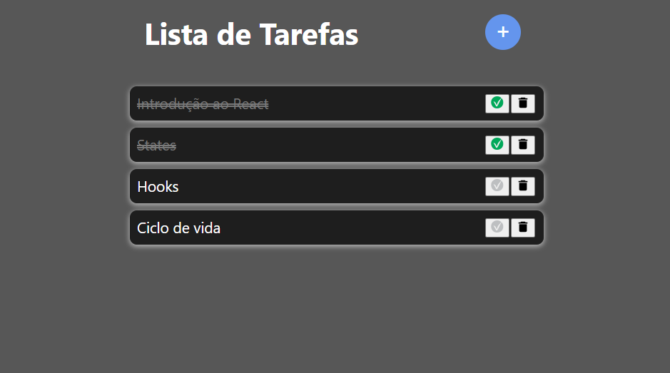

# Projeto ToDo List

Projeto Todo List é um projeto de listagem de tarefas. Com o objetivo de manter a organização e conclusão de cada tarefa imposta.

Feito a parte de Form para cadastrar as tarefas através de um modal e a parte das listas onde cada uma delas tem a opção de deletar e ticar como feito quando a tarefa é concluída.

Frameworks Usados:

- React
- Redux

